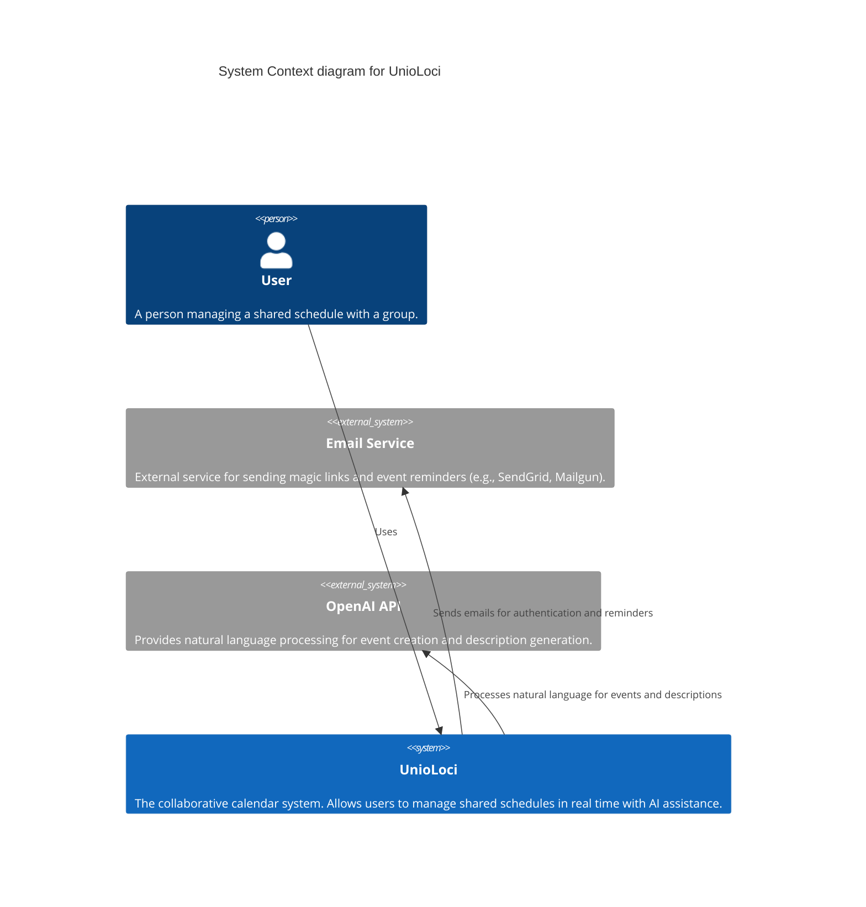
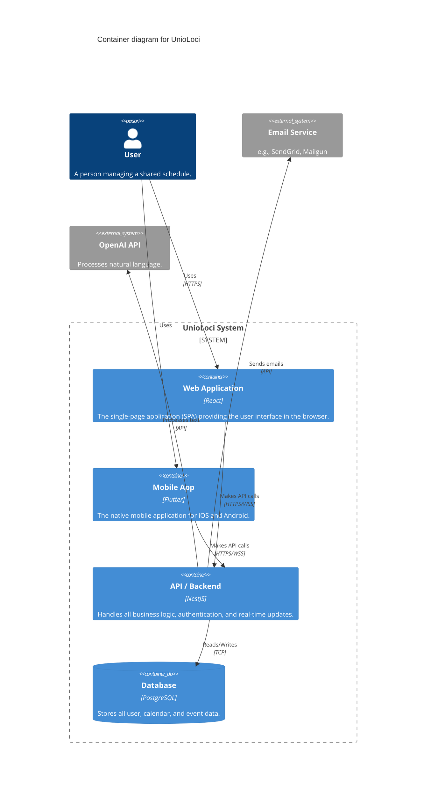

# Architecture Documentation

**Project:** UnioLoci  
**Version:** 1.0  
**Date:** November 17th, 2025  
**Author:** Josué Cruz

---

## 1. Philosophy: Diagrams as Code

This project uses **Mermaid.js** to create and maintain architecture diagrams directly within Markdown files. This approach, known as "Diagrams as Code," has several key advantages:

- **Version Control Friendly:** Diagrams are plain text, making them easy to track, diff, and review in Git pull requests.
- **Easy to Edit:** No special software is needed. Anyone can edit the diagram by changing a few lines of text.
- **Single Source of Truth:** The architecture documentation lives alongside the code and other documents, reducing the risk of it becoming outdated.
- **Automatic Rendering:** Platforms like GitHub, GitLab, and many Markdown editors automatically render Mermaid code into visual diagrams.

---

## 2. System Context Diagram (C4 Model - Level 1)

This diagram shows a high-level view of UnioLoci, its users, and the external systems it interacts with. It answers the question: **What are the key systems and actors involved in our ecosystem?**

### Diagram Components:

- **User:** The end-user of the application.
- **UnioLoci System:** Our entire application, treated as a single black box.
- **Email Service:** External dependency for sending transactional emails.
- **OpenAI API:** External AI service for natural language processing.

---

## 3. Container Diagram (C4 Model - Level 2)

This diagram zooms into the "UnioLoci System" box from the context diagram. It shows the main deployable/runnable components (containers) that make up the system and how they interact.

