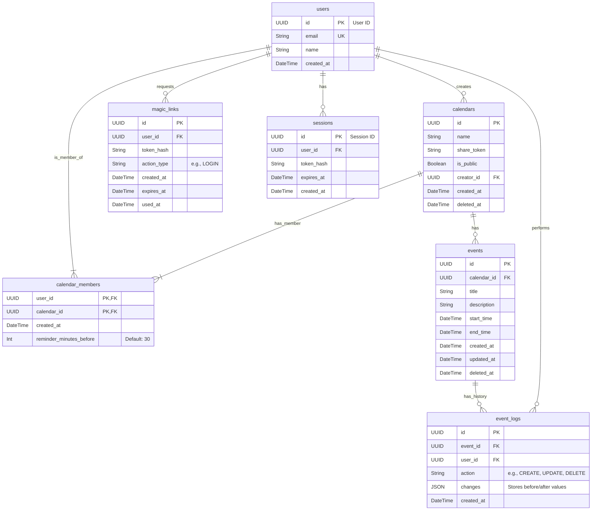

# Database Schema

**Project:** UnioLoci  
**Version:** 1.0  
**Date:** November 17th, 2025  
**Author:** Josué Cruz

---

## 1. Overview

This document defines the database schema for the UnioLoci project. The chosen database is **PostgreSQL**, selected for its robustness, support for complex queries, and reliability.

The schema is designed to be simple and efficient for the MVP, focusing on the core entities: Users, Calendars, Events, and their relationships.

---

## 2. Entity-Relationship Diagram (ERD)

The following diagram illustrates the main tables and their relationships. It is generated using Mermaid.js, allowing it to be version-controlled and easily updated.

---

## 3. Table Definitions

### `users`

| Column       | Type           | Constraints      | Description                              |
| ------------ | -------------- | ---------------- | ---------------------------------------- |
| `id`         | `UUID`         | Primary Key      | Unique identifier for the user.          |
| `email`      | `VARCHAR(255)` | Unique, Not Null | User's email, used for magic link login. |
| `name`       | `VARCHAR(255)` | Nullable         | Display name for the user.               |
| `created_at` | `TIMESTAMPTZ`  | Not Null         | Timestamp of user creation.              |

### `calendars`

| Column        | Type           | Constraints              | Description                                  |
| ------------- | -------------- | ------------------------ | -------------------------------------------- |
| `id`          | `UUID`         | Primary Key              | Unique identifier for the calendar.          |
| `name`        | `VARCHAR(255)` | Not Null                 | Name of the shared calendar.                 |
| `share_token` | `VARCHAR(255)` | Nullable                 | Token used to join private calendars.        |
| `is_public`   | `BOOLEAN`      | Not Null, Default: false | If true, the calendar is viewable by anyone. |
| `creator_id`  | `UUID`         | Foreign Key (users.id)   | The user who created the calendar.           |
| `created_at`  | `TIMESTAMPTZ`  | Not Null                 | Timestamp of calendar creation.              |
| `deleted_at`  | `TIMESTAMPTZ`  | Nullable                 | Timestamp for soft-deleting the calendar.    |

### `calendar_members`

This is a join table representing the many-to-many relationship between users and calendars.
| Column | Type | Constraints | Description |
|---|---|---|---|
| `user_id` | `UUID` | Composite PK, FK (users.id) | The user who is a member. |
| `calendar_id` | `UUID` | Composite PK, FK (calendars.id) | The calendar they are a member of. |
| `created_at` | `TIMESTAMPTZ` | Not Null | Timestamp of when the user joined. |
| `reminder_minutes_before` | `INTEGER` | Not Null, Default: 30 | User-specific reminder setting for this calendar. 0 equal to doesn't reminder |

### `events`

| Column        | Type           | Constraints                | Description                                     |
| ------------- | -------------- | -------------------------- | ----------------------------------------------- |
| `id`          | `UUID`         | Primary Key                | Unique identifier for the event.                |
| `calendar_id` | `UUID`         | Foreign Key (calendars.id) | The calendar this event belongs to.             |
| `title`       | `VARCHAR(255)` | Not Null                   | The title of the event.                         |
| `description` | `TEXT`         | Nullable                   | Detailed description, potentially AI-generated. |
| `start_time`  | `TIMESTAMPTZ`  | Not Null                   | Start date and time of the event.               |
| `end_time`    | `TIMESTAMPTZ`  | Not Null                   | End date and time of the event.                 |
| `created_at`  | `TIMESTAMPTZ`  | Not Null                   | Timestamp of event creation.                    |
| `updated_at`  | `TIMESTAMPTZ`  | Not Null                   | Timestamp of the last update.                   |
| `deleted_at`  | `TIMESTAMPTZ`  | Nullable                   | Timestamp for soft-deleting the event.          |

### `event_logs`

This table provides an audit trail for all changes made to events.
| Column | Type | Constraints | Description |
|---|---|---|---|
| `id` | `UUID` | Primary Key | Unique identifier for the log entry. |
| `event_id` | `UUID` | Foreign Key (events.id) | The event that was modified. |
| `user_id` | `UUID` | Foreign Key (users.id) | The user who performed the action. |
| `action` | `VARCHAR(50)` | Not Null | The type of action performed (e.g., 'CREATE', 'UPDATE', 'DELETE'). |
| `changes` | `JSONB` | Nullable | A JSON object detailing what changed (e.g., old and new values). |
| `created_at` | `TIMESTAMPTZ` | Not Null | Timestamp when the change occurred. |

### `magic_links`

This table stores single-use magic links (passwordless login / actions).
| Column | Type | Constraints | Description |
|---|---|---|---|
| `id` | `UUID` | Primary Key | Unique identifier for the magic link. |
| `user_id` | `UUID` | Foreign Key (users.id), Not Null | The user the link was issued for. |
| `token_hash` | `VARCHAR(255)` | Not Null | Hashed token used to validate the magic link; do not store raw tokens. |
| `action_type` | `VARCHAR(16)` | Not Null, Default: 'LOGIN' | Purpose of the magic link (e.g., 'LOGIN'). |
| `created_at` | `TIMESTAMPTZ` | Not Null | When the magic link was created. |
| `expires_at` | `TIMESTAMPTZ` | Not Null | Expiration timestamp for the link. |
| `used_at` | `TIMESTAMPTZ` | Nullable | Timestamp when the link was consumed (set on use). |

**Security notes:** store only a secure hash of the token, mark `used_at` when consumed to enforce single-use, use a constant-time compare for validation, and periodically purge expired links with a background job.

### `sessions`

This table stores active user sessions, created after a successful login.
| Column | Type | Constraints | Description |
|---|---|---|---|
| `id` | `UUID` | Primary Key | Unique identifier for the session. |
| `user_id` | `UUID` | Foreign Key (users.id), Not Null | The user this session belongs to. |
| `token_hash` | `VARCHAR(255)` | Not Null, Unique | Hashed session token. The raw token is sent to the client. |
| `expires_at` | `TIMESTAMPTZ` | Not Null | Expiration timestamp for the session. |
| `created_at` | `TIMESTAMPTZ` | Not Null | When the session was created. |

**Security notes:** On logout, the corresponding session record should be deleted. A background job can periodically clean up expired sessions. This stateful approach allows for immediate session invalidation (e.g., remote logout).
